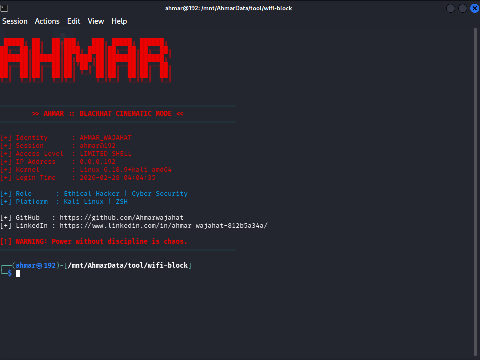

# 🔐 Wi‑Fi Recon Automation – Academic Demo

> **Educational Cyber Security Project**  
> Ethical Wi‑Fi Recon & Python Automation Framework

---

## 📌 Project Overview

This project is an **academic demonstration** of a Wi‑Fi reconnaissance and automation framework written in **Python**.  

> ⚠️ **Important:** This code is strictly for **educational purposes**.  
> It **prepares commands** for Wi‑Fi scanning and monitor mode but does **not execute attacks automatically**.  
> Designed for **university labs and private network demonstrations only**.

---

## 🛠️ Requirements

To run this project, your environment must include:

- **Operating System:** Linux (Debian-based Linux recommended)  
- **Python:** 3.x  
- **Wireless Adapter:** Supports monitor mode  
- **Linux Tools:**  
  - `airmon-ng`  
  - `airodump-ng`  
  - `iwconfig`  
# 🔐 Wi-Fi Recon Automation (Educational Use)

> **Ethical Hacking Project | Academic Demonstration**

---

<div align="center">
  
  
  
  
</div>

---

## 📌 Project Overview

This project is a **Python-based Wi-Fi reconnaissance and automation framework** created strictly for **educational and academic purposes**.  

It demonstrates:

- Enabling **monitor mode** on wireless adapters
- Scanning Wi-Fi networks using `airodump-ng`
- Parsing CSV outputs
- Displaying results in a clean, educational format
- Modular Python design with **ASCII banner & system info**

> ⚠️ **Note:** This code does **not execute attacks automatically**. It is intended for **private network labs and university demonstrations only**.

---


pip install pyfiglet colorama scapy
**Optional Python Libraries (for enhanced banner / terminal styling):**
```bash
pip install pyfiglet colorama scapy
## 🏗️ Environment Setup (Python Virtual Environment)

### 1. Create a virtual environment
```bash
python3 -m venv env
source env/bin/activate
env\Scripts\activate

# Install dependencies from requirements.txt
pip install -r requirements.txt
\


# 💻 Running the Project

# Once the environment is ready:

sudo python3 wifi_block.py
# after running


---

If you want, I can **integrate this directly into the full README** so the **environment setup, requirements, and running instructions** all appear **in one polished, professional file** ready for GitHub.  

Do you want me to do that?

Output is:
## 🖼 Screenshots

### Banner Display


### Wi-Fi Scan Output


### Network Selection

